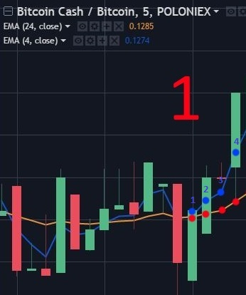
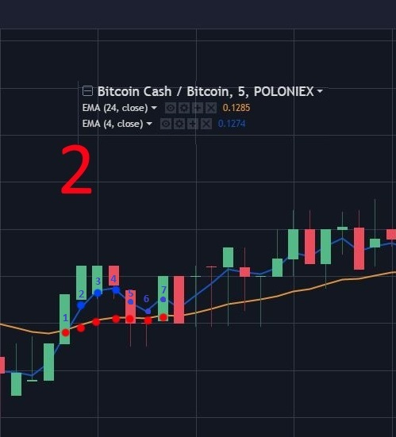
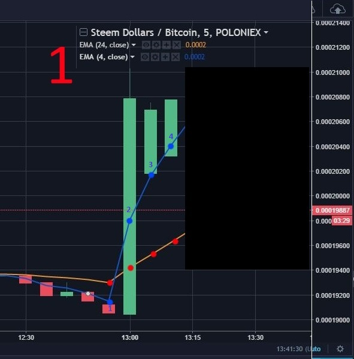
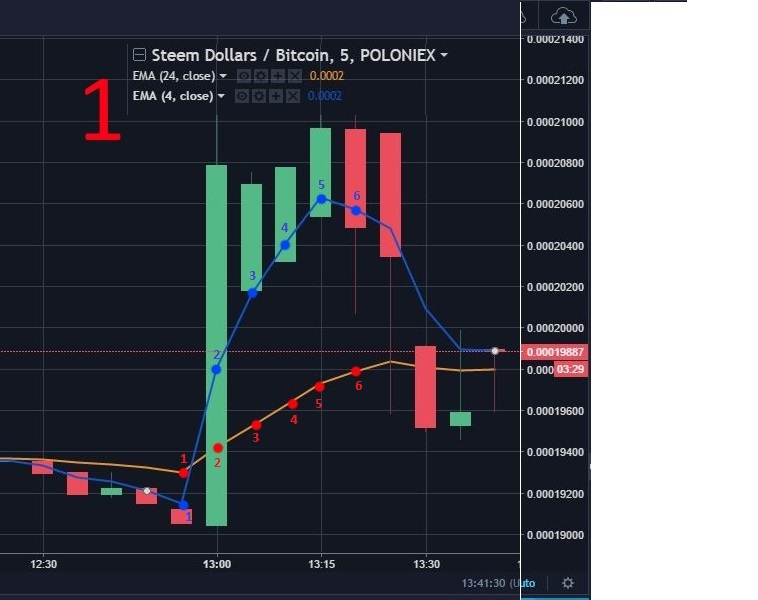

拉高甩货保护策略 (Pump And Dump Protection Strategies) 
用机器人来保护账户仓位，避免被拉高甩货的定义与因由 
    在传统交易市场，拉高甩货是一种骗局，有机会会被证监单位喊停查封，例如股票市场，串谋者事先买进特定股票，
然后大力吹捧这些股票，通常是在互联网上发布虚假的乐观讯息，藉此推高股价，然后在高位出脱持股票赚取暴利。串谋
者出货后，股价会急跌。这种骗局通常发生在小盘股上，因为这种股票较易操纵。但在币圈里，由于监管还是不足，龙蛇
混杂，每日也有新的 ICO 在各大交易所上市，每只 ICO 都有自己的相声团，所以拉高甩货是经常在网上媒体和群组中
发生，而且更因为有机器人的帮助拉高甩货日益猖獗，规模日益壮大，甩货派货速度更不断增加。当 ICO 的发起人预先
大量拥有新发行币种或预挖币，而他们更不像股票，拥有相应的资产来换取上市条件时，唯一躯使发行币可短时间快速上
升的手段不是公司资产增值，而是不断发放内部利好消息和推广发行币本身的稀有性这些动力来造市，这造就这币圈经常
出现突然大升后大跌。机器人是两面刃，其本质不坏，只是如何设计机器人，用在谁手上，使用目的为何。机器人进可攻
，退亦可守，以下就是教大家如果在瞬息万变的币圈中使用机器人守护自己仓位之余赚钱，同时避免落入庄家的陷阱。试
想一下，既然机器人可以全天候监控，当在玩家不在意的币种刚有拉高讯号的前期时买入，然后和庄家一起坐等大升，这
不是很美满吗？事不疑迟，立即介绍保护策略: 
举例: 由 EMACROSS 颜色点点开始 
<B>BCH_BTC</B> 
 
1、当两线相交时，我们就会看那个 EMA_cross_candles 的值来决定买入或卖出行动的可能性。 
举例：当 EMA_cross_candles = 3 就是说认定那支阴阳烛是两线相交后的目标阴阳烛，机器人会直接忽视相交之前
的数据，由相交点开始数三支阴阳烛即三点，带到去第四个蓝点，当这样就是说忽略 EMACROSS 值，这时 EMACROSS 
是在范围带以内的，即币价是在下线之上，亦即是大过 ALL_buy_value = 0.1 ，机器人就会下单买入。 
 
2、同上面图一一样, 但是要小心, 这个币可以在 EMACROSS 发生之后再下跌。在这情况下 EMACROSS 值是 0.1% 
以上，同时亦是在买入范围之内。机器人就会下单买入。EMACROSS 不是完美的，买入后亦都可以有下跌的风险，同所
有其他的策略一样都有机会被套牢的。 

<B>SBD_BTC</B> 
 
 
1. 这个例子是 Steem Dollors，参数 EMA_cross_candles = 3，可以清楚看到那币在第二个蓝点被拉高。在第
四蓝点，买入值已经大幅抛离 EMA 下线和高过 0.1% (参数 ALL_buy_value = 0.1%)，所以没有设限制的机器人
会下单买入了。 这时 ALL_buy_value_limit 参数就起了作用。在第六个蓝点，投资者已在庄家拉高甩货后被套牢
了(Bag)。但这机器人很厉害，用了ALL_buy_value_limit = 3 这参数来自我限制，机器人就有可能避此一劫，当
在第四蓝点，现价高过 EMA 下线 3% 时就禁止买入了。 
设定和 BCH_BTC 一样。可以清楚看到那币都在被拉高。在第四个蓝点时买入值是正数而且大过 0.1%，所以机器人会
买入，但到第个蓝时，弊了，又被套牢。所以同样用参数 buy_value_limit 来避免套牢发生，因为在第四点时
 EMACROSS 是高过 3% 而被禁止购买了。 